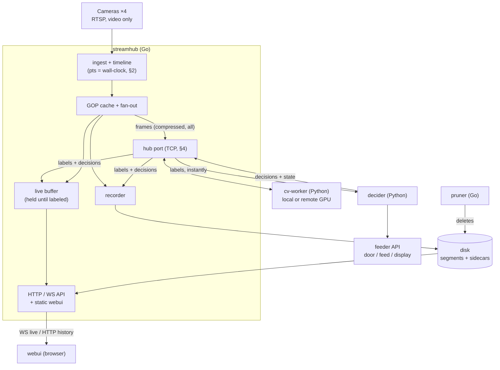

# Redesign plan: video pipeline

Status (2026-09-28): M1–M6 implemented on branch `redesign`; the previous
stack's services are removed from it (see README.md, Migration). Decided while
building: cv-worker caps inferences per camera (`CV_MAX_FPS`, default 2); decider
has `dry_run` for running next to the old feeders; decider's empty-bowl feeding
is dropped (needed the old detector's bowl monitor); per-feeder
`door_close_timeout_sec` 10 s and `min_meal_sec` 15 s.

Start fresh — no backward compatibility with existing recordings, `events.db`,
or services (training still reads them until it is adapted).

## Temporary workarounds (felisis after the haircut)

Remove once the identity classifier is retrained (and YOLO checked):

| Where | What | Why |
|---|---|---|
| config.yaml feeder3 | `allowed_cats: [felisis, unknown]` | classifier doesn't recognise felisis |
| config.yaml feeder3 | `open_if_any_allowed: true` | felisis also shows up as alisa |
| config.yaml feeder3 | `door_close_timeout_sec: 60` | YOLO often misses felisis |
| config.yaml camera black | `cv.yolo_conf: 0.05` | diagnosis: does YOLO see felisis at low scores? Set to just below her scores, or back to default |

## 1. Components



Data path for labels: camera → streamhub → cv-worker → streamhub → decider →
streamhub → webui + disk. Raw CV results and decider output are both stored and
shown; streamhub is the single place that joins them with video.

| Component | Language | Role | Serves |
|---|---|---|---|
| `streamhub` | Go (gortsplib v5, mediacommon v2) | RTSP ingest, timestamps, recording, dispatch to cv-worker/decider, joins labels + decisions with video, live + history | **All** network endpoints: HTTP/WS for webui, TCP hub port for cv-worker and decider, the webui's static files |
| `cv-worker` | Python | Stateless: compressed frames in → detections out. Harness + pluggable model | nothing (client) |
| `decider` | Python (ports `feeder/`) | Feeding logic + feeder API + display; reports its state back | nothing (client) |
| `pruner` | Go (same module as streamhub) | Sparsify old footage around events, enforce size cap, honor pins | nothing |
| `webui` | Svelte + Vite, **static SPA** (no SSR) | Grid + single view, live + history via one MSE player, synced timelines | — (files served by streamhub, embedded or from a dir) |

Removed: mediamtx, `detector/`, `indexer/` (kept a SQLite table of mediamtx's
recording files for the old timeline — streamhub knows its own segments now), Python
`pruner/`, `feeder/` (moves into decider).
Out of scope but affected: `training/`, `review/` read the old data layout; adapt later.

## 2. Timeline and frame identity

Measured camera behaviour (2026-09-27 captures): RTP timestamps are honest and
monotonic; RTCP sender reports are garbage; clocks drift −40…+165 ppm; arrival is
bursty (up to ~1 s); fps varies per camera (15 / 30 / 30-with-drops).

- **Frame key = `(camera, pts)`**, where `pts` is in 90 kHz ticks **since the Unix epoch**
  (media time *is* wall-clock time). Strictly increasing per camera, forever.
- `pts = anchor_wall + (rtp_extended − anchor_rtp)`, RTP unwrapped by gortsplib.
- Drift: continuously estimate each frame's wall-clock time from arrival times using a
  **lower envelope** (minimum lag over a sliding window — bursts only ever delay).
  Correct by **slewing** (frame durations adjusted by a bounded amount, e.g. ≤ 500 ppm),
  never by jumping. Frame spacing stays honest (no constant-frame-rate rewrite).
- RTCP ignored entirely.
- Reconnect / new RTSP session: new anchor from arrival time, clamped so pts stays
  > last pts. A gap is a gap.
- Risk to verify in M2: browsers with media time ≈ 1.8e9 s. Mitigation: MSE
  `timestampOffset` (client-side rebase), files unchanged.

## 3. Storage

```
data/
  recordings/CACHEDIR.TAG
  recordings/<camera>/<YYYY-MM-DD>/<HH>/<start-UTC-ISO-ms>.mp4           fMP4 segment
  recordings/<camera>/<YYYY-MM-DD>/<HH>/<start-UTC-ISO-ms>.labels.jsonl  sidecar
  pins.json                                                                ranges exempt from pruning
```

- **Only the video track is set up** with the camera (RTSP SETUP of video media only):
  audio never leaves the camera, so there's nothing to drop or store.
- Segments: fMP4 (init + one fragment per GOP), cut at the first keyframe after the
  target length (default **10 s**, configurable — see §11). Written as `*.part`,
  renamed on close. New segment on SPS/PPS change or reconnect.
- Filenames carry start time → the whole index is derivable from a directory listing.
  **Files are the source of truth**; any DB/cache is rebuildable from them.
- streamhub keeps an in-memory index (scan at startup, update on close, periodic
  rescan + treat a missing file as deleted) so external deletion (pruner, admin) is fine.
- `CACHEDIR.TAG` (standard signature, honored by tar `--exclude-caches`, borg, restic):
  created in `recordings/` on startup unless opted out in config. Any genuine cache
  directory gets one unconditionally.
- **Sidecar** = a separate file next to the segment, same base name, `.labels.jsonl`
  extension — *not* a track inside the MP4 (browsers' MSE rejects non-audio/video
  tracks; results arrive after the frame; must be queryable and appendable on its own).
  Deleted together with its segment. One JSON object per line, typed:
  - `{"t":"cv", pts, model, worker, infer_ms, dets:[…]}` — one per **processed** frame,
    including ones with no detections ("looked, found nothing" ≠ "didn't look").
    Each det: `box` [x,y,w,h] in camera coords; `score` = detector confidence that the
    box is a cat at all (YOLO); `cats` {name: p} = identity classifier's probability
    per known cat for that box (sums to 1); optional `emb` (base64 float16).
  - `{"t":"decision", pts, …}` — decider's state/decision records (§6).
  Appended as results arrive; closed when results have passed the segment end or after
  a timeout.
- Timeline summaries (per-segment counts / per-cat maxima) for a fast day-scale
  timeline: cached, rebuildable from sidecars. Exact form decided in M4.

## 4. Hub port: streamhub ↔ cv-worker / decider

One internal protocol for all non-browser clients. TCP, streamhub listens (default
`:9000`); **clients connect** (they come and go — remote GPU box may reboot).
Messages: 4-byte big-endian length + msgpack map. One shared Python client library
(`hubclient`) for cv-worker and decider.

| Direction | Message | Fields |
|---|---|---|
| C→H | `hello` | client_id, role (`cv` / `decider`), cameras ("*" or list); cv: model {name, version, classes}, priority |
| H→cv | `stream` | camera, codec, sps, pps, width, height, camera config (rotate_deg, roi, …) — on start, reconnect, param change |
| H→cv | `frame` | camera, pts, key, data — **every** frame, starting from cached GOP |
| cv→H | `result` | camera, pts, infer_ms, dets […] |
| H→decider | `result`, `status` | results forwarded immediately; camera up/down, cv up/down |
| decider→H | `decision` | camera, pts, state/decision payload (§6) |
| both | `ping` | liveness |

cv-worker internals (one TCP connection carries all its cameras, every message tagged
with its camera):
- Reader thread: reads the socket, feeds each frame into that camera's own decoder
  (PyAV `CodecContext`, one per camera) — every frame must be decoded because
  P-frames depend on earlier ones. Result goes into a per-camera "latest frame" slot
  (overwriting — nothing queues).
- Inference thread: loops over cameras with a fresh unprocessed frame, oldest-served
  first (round robin), so a slow model spreads evenly. On GPU, optionally infer all
  fresh frames as one batch.
- If decoding itself falls behind (lag reported per camera): skip to the next keyframe.
  If the GIL or CPU turns out to be the bottleneck in M4 → one decode process per
  camera, or VAAPI hardware decode.
- Per-camera model config arrives in `stream` → worker has no config beyond model paths.
- 1 worker for all cameras or 1 per camera = deployment choice, same code.
- Worker gone → streamhub sends `status: cv_down` to decider.
- Later (M7): alternative "pool" model — streamhub dials a configured list of worker
  URLs and picks the first available by priority. Multiple workers per camera
  (primary drives decider; others for A/B) — results are already tagged with model.

## 5. Browser API (all served by streamhub)

| Endpoint | Kind | Purpose |
|---|---|---|
| `/` | static | webui SPA |
| `/api/cameras` | HTTP | camera list + config needed by UI |
| `/api/live/<camera>` | WS | ordered stream: binary fMP4 fragments (per frame) + JSON label and decision messages |
| `/api/recordings/<camera>?from&to` | HTTP | segment list (start, end, file URL, sidecar URL) |
| `/recordings/…` | HTTP | segment and sidecar files, Range supported |
| `/api/timeline/<camera>?from&to&bucket` | HTTP | per-cat density for the timeline |
| `/api/pins` | HTTP | pins CRUD |

WS for live because it's a continuous server→browser push (plain HTTP would need
polling). Browser WS is the only WS; internal clients use the hub port.

- Live: a frame is released when a result for a pts ≥ it has arrived, or after a max
  hold (~2 s) so live never stalls when CV is down. Starts from the cached GOP.
  Labels carry pts; the client draws the latest label with pts ≤ displayed frame,
  dashed when older than a threshold. No interpolation.
- History: same MSE player as live, HTTP source; gaps known from the segment list.
  Gap playback: gap < ~2 s (configurable) → show "no data" and wait out the gap in
  real time. Longer → show large `>> 09:00` (gap length: MM:SS, HH:MM:SS from 1 h)
  for ~2 s, then jump to the next segment.

## 6. decider

- **First iteration = port of `feeder/` as-is** (door FSM, zone state, decision,
  journal, schedule, feeder client), only switching input from the detector WS to
  the hub port. No new smoothing/filtering yet (fix only obvious bugs).
- Sends `decision` messages back to streamhub (stored in sidecars, shown in webui):
  at least door state changes with reason, plus the per-cat state it decided on — so
  webui can answer "why". Later iterations add smoothed/filtered per-cat values here
  (plots).
- Loss of CV (`status: cv_down` or no results for N seconds) → **close an open door**,
  same as the current feeder's `stream_lost` fail-safe.
- Feeder display: letter-coded status (one letter per cat + state). Short text only
  (~5 chars, exact limit TBD — feeder server handles long strings poorly), at most
  1 update/s, and only when the text changes.
- Scheduled feeding (adding food) is independent of CV and unaffected.

## 7. pruner

- Go binary in streamhub's module (shares segment naming + sidecar parsing).
- Never touches `*.part` or anything newer than **3 h** (configurable).
- Older: delete segment + sidecar unless any detection within ±30 s (looks at
  neighbouring sidecars) or pinned. Segments never processed by CV: **deleted** by
  default (configurable).
- Then cap total size (default 50 GB): evict oldest unpinned first.
- Dry-run mode.

## 8. Config and deployment

- One `config.yaml` for now: cameras (id, label, rtsp, rotate_deg, roi, …),
  streamhub, pruner, decider/feeders. RTSP credentials in a gitignored secrets file / env.
  Camera `id` is the join key between sections.
  Known drawback: unclear ownership of keys (every component sees everything).
  Each component reads only its own section; revisit per-component config later.
- docker compose: `streamhub` (bridge network — no host networking without WebRTC;
  ports: web, hub), `cv-worker`, `decider` per feeder, `pruner`.
- Remote cv-worker: same image with `STREAMHUB=<server>:9000`.
- Repo layout: `streamhub/` (Go module: `cmd/streamhub`, `cmd/pruner`, `internal/…`),
  `cv-worker/`, `decider/`, `hubclient/` (shared Python), `webui/`. Old dirs deleted
  when replaced.
- **Keep our custom model files** (`models/`, gitignored): trained classifiers under
  `models/trained/`, deployed exports under `models/classifier/versions/` — the latter
  exist only on the server (didn't survive the copy); re-exportable from `trained/`.
  cv-worker mounts `models/` read-only.

## 9. Build order (each milestone usable on its own)

| # | Milestone | Done when |
|---|---|---|
| M1 | streamhub ingest + recorder for all cameras: reconnect/backoff, timeline (§2), segments, CACHEDIR.TAG, in-memory index, list + file API | 24 h recording: continuous pts, bounded drift vs wall-clock, survives camera reboot |
| M2 | webui history: MSE player, recordings timeline, gap playback, grid + single view, synced timelines (shared hover) | smooth playback across segments and gaps in Chrome + Firefox |
| M3 | live over WS/MSE (no CV yet), GOP cache | instant start, stable latency |
| M4 | hub port + `hubclient`; cv-worker harness + YOLO/classifier port; sidecars; labels on live stream + held live buffer; overlays; timeline density | frame-exact boxes live and in history |
| M5 | decider (port feeder) on hub port; decisions to sidecars + webui; display status | feeder behaves as before + status display + "why" visible in webui |
| M6 | pruner + pins | old footage sparsified, cap enforced, streamhub unaffected |
| M7 | later: worker pool / remote GPU priority, A/B models, decider smoothing, per-cat plots, substreams | — |

cam-recorder (cam4) keeps running separately; its timestamp TODO is independent.

## 10. Test data

Timing unit tests for §2 replay real camera behaviour: per-packet (arrival, RTP ts)
CSVs from the 2026-09-27 captures in `streamhub/testdata/camera-timing/` (all four
cameras, both fps settings; see its README) — no video needed. For end-to-end tests, a tiny synthetic H.264 stream re-timed with
the real timestamps.

## 11. Decisions and open questions

1. Segment length: **10 s** default, configurable. File count is small in practice:
   50 GB at ~1 Mbit/s ≈ 35k segment files total; ≤ 360 per hour directory. 30 s would
   keep up to ~2 min around each event instead of ~80 s, and make history seeks fetch
   more before playing.
2. Unprocessed segments: deleted by default, configurable. ✔
3. Sidecar format: JSONL only. Reading/writing goes through one module in Go and one
   in Python, so switching (or adding msgpack/gzip for closed sidecars) later is local.
   Supporting both from the start isn't worth it. ✔
4. Decider decisions: in sidecars via streamhub. ✔
5. Decider when CV is down: close an open door, like the current feeder. ✔
