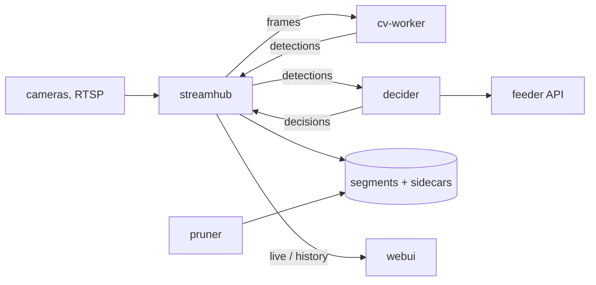

# cat_detection

Self-hosted multi-camera cat detection and feeder control: records the cameras'
H.264 without re-encoding, identifies cats per frame, opens each feeder only for
its allowed cats, and shows live and recorded video with frame-exact detections
in a browser. Design and decisions: [PLAN.md](PLAN.md).



| Component | What |
|---|---|
| `streamhub/` (Go) | RTSP ingest, wall-clock timestamps, fMP4 recording, hub port for CV workers and the decider, HTTP/WebSocket API, serves the webui. Also contains `pruner`. |
| `cv-worker/` (Python) | Decodes frames from streamhub, runs YOLO + the per-cat classifier, returns boxes with per-cat probabilities. |
| `decider/` (Python) | Feeding logic (door state machine, scheduled feeding, meal journal); drives the feeder API. |
| `hubclient/` (Python) | Client for streamhub's hub protocol, shared by cv-worker and decider. |
| `webui/` (Svelte) | Grid or single camera, live and history in one player, synced timelines, detection overlays, decisions. |
| `training/`, `review/` | Labeling and classifier training (still read the previous stack's `data/events` and `data/recordings`). |

## Run

```bash
cp config.example.yaml config.yaml     # cameras, feeders, pruner — see comments
mkdir -p secrets && $EDITOR secrets/streamhub.env   # CAM_GREY_PASSWORD=… (for ${VAR} in config.yaml)
# The identity classifier: models/classifier/current -> versions/<id> (see below).
just up                                # build + start everything
just status                            # per-camera ingest status
# Web UI: http://<host>:8096 (STREAMHUB_PORT)
```

Data lives in `data/streamhub/` (recordings with their `.labels.jsonl`
sidecars, the feed journal, pins). `CACHEDIR.TAG` keeps backup tools out of
the recordings.

`decider` starts with `dry_run: true` in the example config: it decides and
journals but never calls the feeder API. Turn it off only after the previous
feeder services are stopped (see Migration).

### Models

- YOLO is exported to INT8 OpenVINO when the cv-worker image is built.
- The identity classifier is mounted from `models/classifier/` (not in git):
  `versions/<id>/{cat_classifier.xml,.bin,classes.json}` with `current` and
  `previous` symlinks. `just classifier-promote` exports the newest
  `models/trained/*/cat_classifier.pt` (with a torch↔OpenVINO parity gate) and
  switches `current`; `just classifier-restart` loads it.

### Commands

`just up | down | ps | logs [service] | status | check`, `just webui-dev` (hot
reload against a running streamhub), labeling/training recipes: `just --list`.

## Migration from the previous stack

Everything below is outside git; copy it from the old checkout.

| What | Where it goes | Why |
|---|---|---|
| `cameras.yaml` | → `config.yaml` + `secrets/streamhub.env` | camera URLs/credentials, feeder ids and serials (already transcribed in `config.example.yaml`) |
| `models/classifier/` (incl. symlinks) | same path | the deployed classifier |
| `models/trained/` | same path | trained checkpoints (re-exportable, needed for promote) |
| `data/feed_journal/journal.db` (+ `-wal`, `-shm`) | `data/streamhub/feed_journal/` | **required before `dry_run: false`**: scheduled feeding checks it for slots already fed today — with an empty journal it would feed the latest missed slots again. Copy with the old feeders stopped. |
| `data/review/`, `reviews.db` (repo root) | same paths | human labels; the root `reviews.db` holds more reviews than `data/review/reviews.db` |
| `data/events/`, `data/recordings/`, `data/replay/`, `data/mlflow/` | same paths | training data and history, if you still train on them |

Not needed: `.env` (old pruner knobs), `secrets/cameras.env`,
`docker-compose.cameras*.yml`, `mediamtx/`, `data/cooldowns/`.
