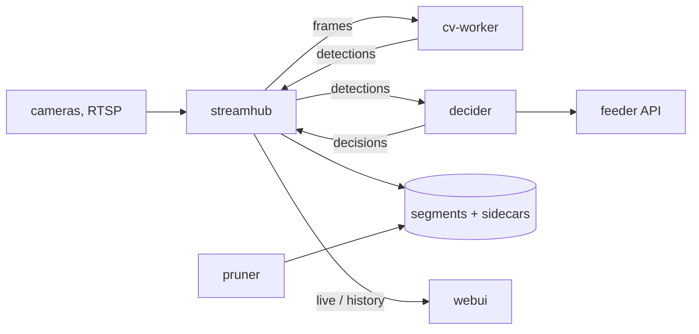

# cat_detection

Self-hosted multi-camera cat detection and feeder control: records the cameras'
H.264 without re-encoding, identifies cats per frame, opens each feeder only for
its allowed cats, and shows live and recorded video with frame-exact detections
in a browser. Design and decisions: [PLAN.md](PLAN.md).



| Component | What |
|---|---|
| `streamhub/` (Go) | RTSP ingest, wall-clock timestamps, fMP4 recording, hub port for CV workers and the decider, HTTP/WebSocket API, serves the webui. Also contains `pruner`. |
| `cv-worker/` (Python) | Decodes frames from streamhub, runs YOLO + the per-cat classifier, returns boxes with per-cat probabilities. |
| `decider/` (Python) | Feeding logic (door state machine, scheduled feeding, meal journal); drives the feeder API. |
| `hubclient/` (Python) | Client for streamhub's hub protocol, shared by cv-worker and decider. |
| `webui/` (Svelte) | Grid or single camera, live and history in one player, synced timelines, detection overlays, decisions. |
| `training/`, `review/` | Labeling and classifier training (still read the previous stack's `data/events` and `data/recordings`). |

## Run

```bash
cp config.example.yaml config.yaml     # cameras, feeders, pruner — see comments
mkdir -p secrets && $EDITOR secrets/streamhub.env   # CAM_GREY_PASSWORD=… (for ${VAR} in config.yaml)
# The identity classifier: models/classifier/current -> versions/<id> (see below).
just up                                # build + start everything
just status                            # per-camera ingest status
# Web UI: http://<host>:8096 (STREAMHUB_PORT)
```

Data lives in `data/streamhub/` (recordings with their `.labels.jsonl`
sidecars, pins; shared with pruner) and `data/decider/` (the feed journal).
`CACHEDIR.TAG` keeps backup tools out of the recordings.

`decider` starts with `dry_run: true` in the example config: it decides and
journals but never calls the feeder API. Turn it off only after the previous
feeder services are stopped (see Migration).

### Models

- Both models are mounted from `models/detector/` and `models/classifier/` (not
  in git): `versions/<run>/` with `current` and `previous` symlinks.
  `just deploy detector|classifier [run]` exports a trained run with that model's
  quality gate, switches `current` and restarts cv-worker; `just rollback` goes
  back; `just models` shows what runs. With no deployed detector, cv-worker runs
  the COCO yolov8n exported to INT8 OpenVINO when its image is built.

### Commands

`just up | down | ps | logs [service] | status | check`, `just webui-dev` (hot
reload against a running streamhub). Labeling/training: `just box-*` (where is
the cat: collect, label boxes, train YOLO) and `just cat-*` (which cat: group,
name, train the classifier); `just` lists them in pipeline order.

## Migration from the previous stack

This workdir is set up and tested as production (`config.yaml` with
`dry_run: false`, `secrets/streamhub.env`, `models/classifier/`); only its
`.env` sets `DECIDER_DRY_RUN=1` so it never drives the real feeders.

On the test machine:

```bash
just down
just clean-history --yes      # test recordings, dry-run journal
just clean --yes              # venvs, node_modules, build output, old-stack leftovers
rsync -a --exclude=/.env --exclude=/data/ ./ server:<new dir>/
```

On the server (new dir; old stack in <old dir>):

```bash
(cd <old dir> && docker compose -f docker-compose.yml -f docker-compose.cameras.yml down)
cp .env.example .env          # set UID/GID if not 1000
mkdir -p data/decider/feed_journal
cp <old dir>/data/feed_journal/journal.db* data/decider/feed_journal/
mv <old dir>/data/{events,recordings,review,mlflow} data/   # training data (optional)
mv <old dir>/reviews.db .                                   # labels (optional)
just up
```

The journal must come from the stopped old feeders: scheduled feeding checks it
for slots already fed today — with an empty journal it would feed the latest
missed slots again.
